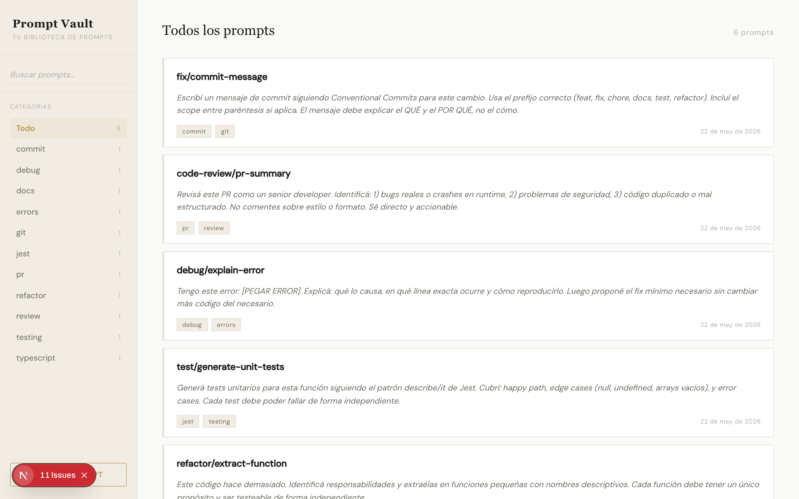

# Prompt Vault

Tu biblioteca personal de prompts para Copilot y AI.



---

## Descripción

Aplicación web para guardar, organizar y reutilizar prompts de Copilot/AI. Estética editorial refinada con sidebar de filtro por tags, búsqueda en tiempo real, copy-to-clipboard y CRUD completo.

## Solución

Se construyó una app Next.js 15 desde cero con Server Actions, base de datos Turso (libsql) para persistencia en la nube y CSS custom con design tokens sin dependencias de UI externas. La migración de better-sqlite3 a @libsql/client permite deploy directo en Vercel con variables de entorno.

## Stack técnico

- **Next.js 15** — App Router, Server Actions, force-dynamic
- **Turso / libsql** — base de datos serverless; fallback a `file:data/vault.db` en local
- **Tipografía** — Playfair Display + Lora + DM Sans (via next/font/google)
- **CSS custom** — design tokens, sin dependencias de UI externas

## Cómo correrlo localmente

```bash
cd prompt-vault
npm install
cp .env.local.example .env.local   # completar TURSO_DATABASE_URL y TURSO_AUTH_TOKEN
npm run dev
```

## Deploy en Vercel

1. `turso db create prompt-vault && turso db tokens create prompt-vault`
2. Setear `TURSO_DATABASE_URL` y `TURSO_AUTH_TOKEN` en Vercel env vars
3. Push a main → deploy automático

## Auditoría pre-PR — hallazgos resueltos

1. **[CRÍTICO]** Server Actions sin `try/catch` → modal se quedaba colgado en error → aplicado `try/catch` en `handleSave` y `handleDelete` con toast de error
2. **[ALTO]** `navigator.clipboard` sin `.catch()` → feedback falso positivo en fallo → agregado `.catch()` con toast de error
3. **[ALTO]** Sin validación de longitud en inputs → potencial DoS → límites: título 200c, body 50k, tags 20 máx, tag 50c
4. **[MEDIO]** Tag array sin límite → O(n) DB operations por request → validación `MAX_TAGS = 20` antes de iterar
5. **[MEDIO]** N+1 query en `getAllPrompts` → reemplazado por único JOIN query con `IN(placeholders)`
6. **[MEDIO]** `setTimeout` sin cleanup → memory leak en unmount → `useRef` para el `timerId` + cleanup en `useEffect`
7. **[MEDIO]** SQLite singleton sin `close()` → file lock en hot-reload → `process.once('exit')` y `process.once('SIGINT')` para cierre limpio
